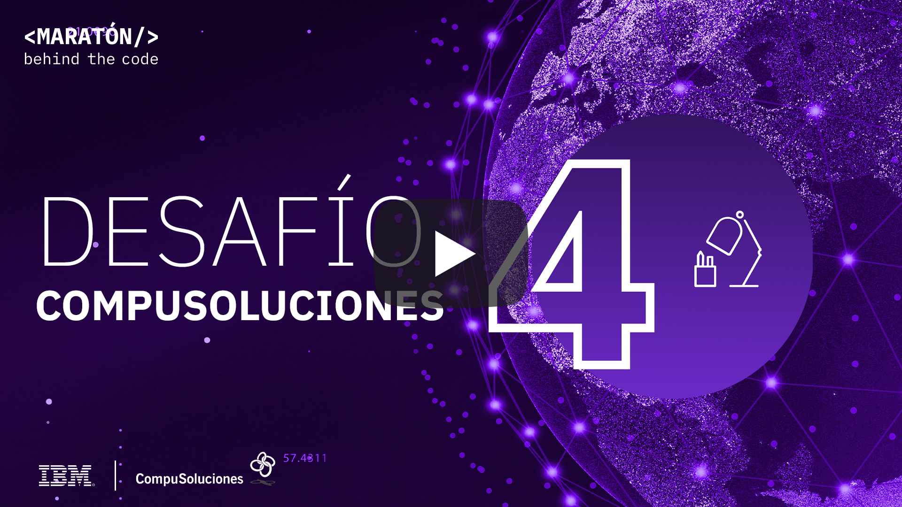
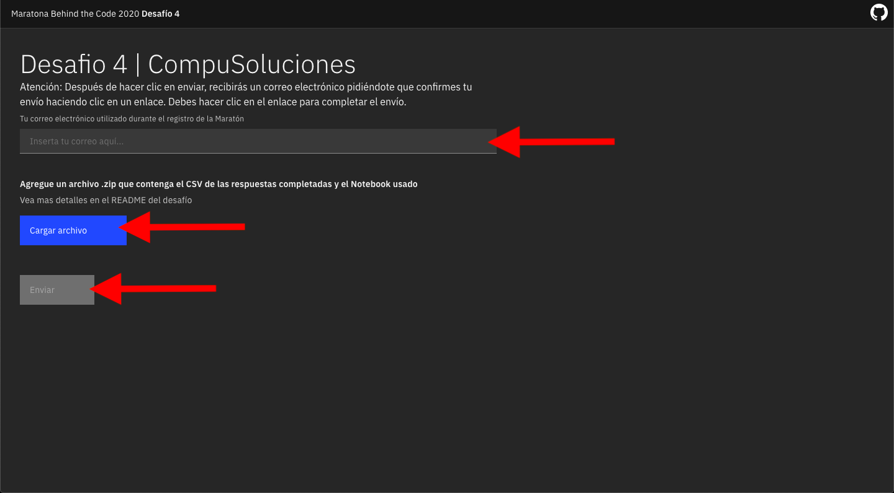

# Desafio 04 | CompuSoluciones

- [1. Acerca de CompuSoluciones](#1-acerca-de-compusoluciones)
- [2. Reto de negocio](#2-reto-de-negocio)
- [3. Objetivo](#3-objetivo)
- [4. Desarrollando la solución](#4-desarrollando-la-solución)
  - [4.1. Pre-requisitos](#41-pre-requisitos)
  - [4.2. Resumen de las tareas](#42-resumen-de-las-tareas)
  - [4.3. Desarrollo](#43-desarrollo)
- [5. Envío](#5-envío)
- [6. Sobre la evaluación](#6-sobre-la-evaluación)

## Para Ayudarte

- [Material de apoyo](#material-de-apoyo)
- [Solución de problemas](#solución-de-problemas)
- [Licencia](#licencia)

## 1. Acerca de CompuSoluciones

CompuSolucioneses una empresa mexicana que en sus 35 años de historia ha logrado convertirse en elm ayorista de valor líder en el mercado mexicano,consolidando un ecosistema tecnológico sólido que atiende a  las  principales  empresas  en  los  mercados  más  importantes, en alianzas de  empresas complementarias como nuestros proveedores y clientes y basados en la vivencia de valores

Uno de los procesos críticos de la compañía es el análisis y otorgamiento de líneas de crédito a sus distribuidores, para mejorar los plazos de recuperación de cartera y disminuir el riesgo de fraude.

    

## 2. Reto de negocio

El objetivo de este desafío es crear un modelo predictivo con la tecnología de IBM,  el modelo resultante debe  ayudar  al  análisis  y  predicción  de  posibles fraudes o  aumento  de  cartera  vencida, calificando  en  semáforos los riesgos de  las principales razones financieras de los socios de negocio que solicitan un crédito, _haciendo cruces de información con el comportamiento de pago de dichos distribuidores con otros proveedores, implementadores y socios de negocio._

Esto  ayudará  a CompuSoluciones a mejorar  la  eficiencia  en  su  proceso  actual  de otorgamiento de crédito y financiamiento.

## 3. Objetivo

CompuSoluciones tiene una enorme cantidad de registro financieros de sus asociados y con la ayuda de herramientas de ciencia de datos es posible crear un modelo de Machine Learning que ayude a clasificar el comportamiento crediticio

En este desafío, CompuSoluciones usará herramientas de IBM como *[Watson Studio (o Cloud Pack for Data)](https://cloud.ibm.com/catalog/services/watson-studio)*  para construir un modelo de Machine Learning natural capaz de predecir la probabilidad de cumplimiento de pago.

La idea esencial del Desafío 4 es crear un modelo basado en machine learning capaz de identificar el comportamiento financiero del asociado de negocio, permitiendo una probabilidad de cumplimiento o incumplimiento del crédito.

## 4. Desarrollando la solución

En este desafío vamos a usar las siguientes herramientas

*[Watson Studio](https://cloud.ibm.com/catalog/services/watson-studio)* proporciona un conjunto de herramientas y un entorno colaborativo para científicos de datos, desarrolladores y expertos en dominios. Es un ambiente de desarrollo (IDE) web que combina herramientas Open Source con tecnología de IBM para desarrollar modelos de Machine Learning y Deep Learning.

Mira el tutorial a continuación para aprender como aplicar la tecnología de IBM para resolver el desafío

**¡ATENCIÓN!** UPDATE EN EL PROCESO DE ENTREGA

Vea el video https://youtu.be/K2qOrWPSwQM con las nuevas instruciones (solo para envíos realizados después del 3 Septiembre)

NOTA: A continuación se muestra el video tutorial, que aún puede ser útil. También demuestra la integración del modelo creado con Watson Machine Learning. Después del 2 de septiembre de 2020, Watson Machine Learning se ha actualizado y este paso ya no es necesario para enviar el desafío.

    

### 4.1. Pre-requisitos

Para poder realizar este desafío, se deben cumplir con los siguientes requisitos previos:

- Estar registradro en la [Maratón Behind the Code](https://maratona.dev/es) y confirmar el e-mail de registro.
- Tener una cuenta en [IBM Cloud](https://ibm.biz/registro-maratona), que puede ser una cuenta GRATUITA o de pago (no es necesario registrarse en el evento con el mismo correo electrónico utilizado para crear su cuenta IBM Cloud).

### 4.2. Resumen de las tareas

1. Cree el servicio [Watson Studio (Cloud Pak for Data as a Service)](https://cloud.ibm.com/catalog/services/watson-studio)  en IBM Cloud. (Si ya lo creo en el desafío 2 no es necesario volverlo a crear)
2. Cree el servicio [Cloud Object Storage](https://cloud.ibm.com/catalog/services/cloud-object-storage) (Si ya lo creo en el desafío 2 no es necesario volverlo a crear)
3. [Crear un nuevo proyecto vacío en Watson Studio](https://dataplatform.cloud.ibm.com/projects/new-project?context=cpdaas).
4. Importar el notebook usando el archivo `notebook.ipynb`
5. Leer y ejecutar las instrucciones contenidas en el Notebook `notebook.ipynb`.
6. Descargar el archivo de resultado `results.csv` y el notebook de trabajo `notebook.ipynb`
7. Envíe su solicitud a [https://compusoluciones.maratona.dev/](https://compusoluciones.maratona.dev/)

### 4.3. Desarrollo

La idea esencial del Desafío 4 es crear un modelo basado en machine learning capaz de identificar el comportamiento financiero del asociado de negocio, permitiendo una probabilidad de cumplimiento o incumplimiento del crédito. 

En este rencuentra el notebook `notebook.ipynb` necesario para crear proyecto completo en Watson Studio ya con una solución básica lista, totalmente funcional. Puede (y se recomienda) mejorar el modelo para obtener una mayor puntuación :)

## 5. Envío

Para hacer la entrega, debes acceder a la siguiente página: [https://compusoluciones.maratona.dev/](https://compusoluciones.maratona.dev/) y cargar un archivo zip con el archivo csv `results.csv` con los resultados de su predicción y el notebook que desarrolló `notebook.ipynb`.

Si cambia el nombre o formato del archivo csv su solución no será evaluada

Si cambia el nombre del notebook su solución no será evaluada

🚨 **PRUEBE SU SOLUCIÓN ANTES DE PRESENTARLA** 🚨

Después de realizar las pruebas, haz clic en el botón en la esquina inferior derecha para ENVIAR TU SOLUCIÓN, como se muestra en la imagen a continuación, y completa el formulario con su dirección de correo electrónico con la que te registraste en MARATÓN 2020.

</img>

## 6. Sobre la evaluación

En esencia, el reto puntuará la calidad de su resultado en el archivo csv. En esta ocación se hara una prueba basada en el _F1 Score_, que mide tanto la presición como el recall. No se desea clasificar como incumplimiento aquellos prestamos que en verdad serian buenos, por lo que el dataset de pruebas estará balanceado. Como se explica en el vídeo tutorial, el problema que debe resolver el modelo de machine learning es un problema clásico de clasificación binaria, y se encuentran más detalles en el notebook jupyter proporcionado.

La rapidez de entrega no se incluye en el cálculo de la puntuación del desafío. Sin embargo, para todos los participantes que presenten este desafío en la primera semana después del lanzamiento, recibirán una bonificación en la puntuación final.

Recuerde que tiene 3 oportunidades de envío de la solución del reto donde se le tomará en cuenta el envío que obtenga mejor puntuación.

## Material de apoyo

- [Video Watson Studio](https://www.youtube.com/watch?v=BecC1U5PJT4)
- [Una guía del portal de IBM Developer para principiantes del Machine Learning](https://developer.ibm.com/es/patterns/use-icp4d-to-build-the-machine-learning-model-for-return-propensity/)
- [Watson Studio Docs](https://dataplatform.cloud.ibm.com/docs/content/?context=cpdaas)

## Solución de problemas

Mira el [video explicativo](#4-desarrollando-la-solución) provisto en la Sección 4, o si lo deseas, revisa la documentación de los servicios involucrados en este desafío.

Accede al discord oficial de la Maratón 2020 para hacer preguntas y/o interactuar con otros participantes: [Discord](https://discord.gg/Q9At74C).

## Licencia

Copyright 2020 Maratona Behind the Code

Licensed under the Apache License, Version 2.0 (the "License");
you may not use this file except in compliance with the License.
You may obtain a copy of the License at

       http://www.apache.org/licenses/LICENSE-2.0

Unless required by applicable law or agreed to in writing, software
distributed under the License is distributed on an "AS IS" BASIS,
WITHOUT WARRANTIES OR CONDITIONS OF ANY KIND, either express or implied.
See the License for the specific language governing permissions and
limitations under the License.
